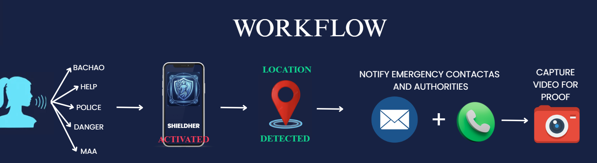
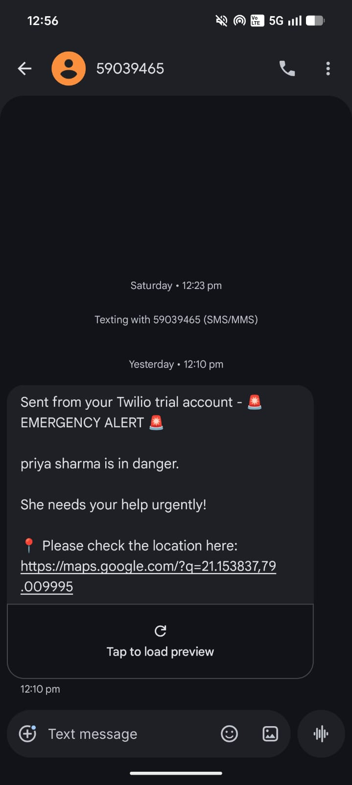

# ShieldHer 🚨🤖

## Overview

**ShieldHer** is a smart AI-powered women safety system that provides instant emergency assistance using voice activation and multi-layered hardware triggering. It is designed to help women quickly alert their emergency contacts and share real-time location during dangerous situations.

When a distress trigger is activated (via voice or hardware), the system immediately:

* Sends emergency SMS alerts
* Makes emergency calls to saved contacts
* Shares live GPS location
* Activates hardware-based emergency trigger system

This project combines **IoT + AI + Full Stack Development** to build a real-time safety solution.

---

## Key Features

* 🎙️ Voice-triggered emergency activation
* 📍 Real-time GPS location tracking
* 📞 Automatic emergency calls to contacts
* 💬 Instant SMS alerts with live location link
* 🔗 Multi-layer safety activation (software + hardware)
* ⚡ Fast response using ESP32 microcontroller

---

## Tech Stack

### Frontend
* React.js
* HTML, CSS, JavaScript

### Backend
* Node.js
* Express.js
* MongoDB (Database)

### Hardware / IoT
* ESP32 microcontroller
* GPS Module (for live location tracking)
* GSM Module (for SMS & calling functionality)

### Communication
* Twilio API is integrated in the backend
* Sends SMS alerts and makes calls via internet

---

## System Architecture

1. User triggers emergency (voice command or hardware button)
2. ESP32 detects trigger signal
3. GPS module fetches current location
4. GSM module sends SMS & makes calls
5. Backend logs event and manages user/contact data
6. Frontend dashboard displays user info and emergency status

---

## 🔄 Workflow

<p align="center">
  
</p>

---

## 📸 Output

<p align="center">
  
  
</p>

---

## 🔧 Hardware Setup

- Connect ESP32 with GPS module (UART pins)
- Connect GSM module for SMS/calling
- Power supply via battery pack
- Upload firmware using Arduino IDE

<p align="center">
  
</p>

---

## Project Structure

```
ShieldHer/
│
├── frontend/ (React App)
├── backend/ (Node + Express API)
├── models/ (MongoDB Schemas)
├── routes/ (API Routes)
├── controllers/
├── hardware/ (ESP32 + GPS + GSM code)
└── README.md
```

---

## Installation & Setup

### Frontend

```
cd frontend
npm install
npm start
```

### Backend

```
cd backend
npm install
npm run dev
```

### Environment Variables (.env)

Create a `.env` file in your backend and add the following:

```
MONGO_URI=your_mongodb_connection_string
PORT=5000

# Twilio Credentials (for SMS & Calls)
TWILIO_ACCOUNT_SID=your_twilio_account_sid
TWILIO_AUTH_TOKEN=your_twilio_auth_token
TWILIO_PHONE_NUMBER=your_twilio_phone_number
```

MONGO_URI=your_mongodb_connection_string
PORT=5000

##OUTPUT





## Hardware Setup

- Connect ESP32 with GPS module (UART pins)
- Connect GSM module for SMS/calling
- Power supply via battery pack
- Upload firmware using Arduino IDE


```

## Future Improvements

- AI-based threat detection using audio analysis
- Mobile app integration
- Cloud-based real-time tracking dashboard
- Wearable device version (smart band / pendant)

---

## Team / Project

Developed as part of an ELITE_HACETHON project focused on **Real-Time Smart Safety Systems using IoT + Web Technologies**.

---

⭐ If you like this project, consider giving it a star!

```
